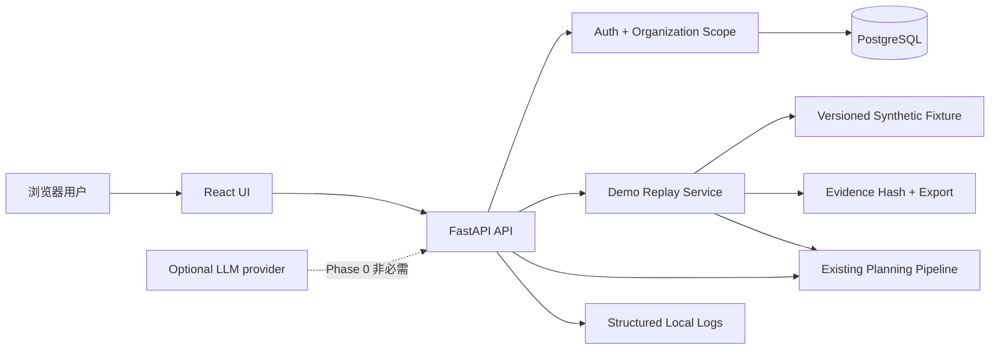
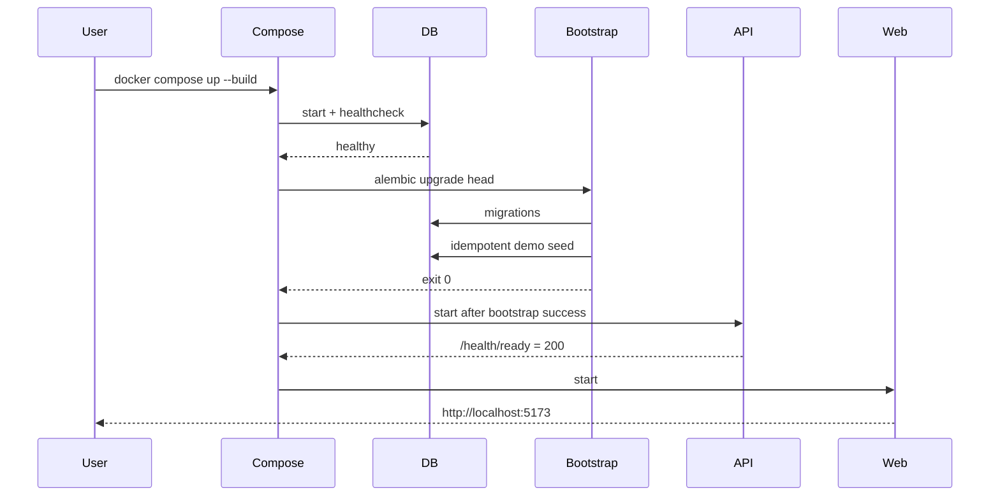
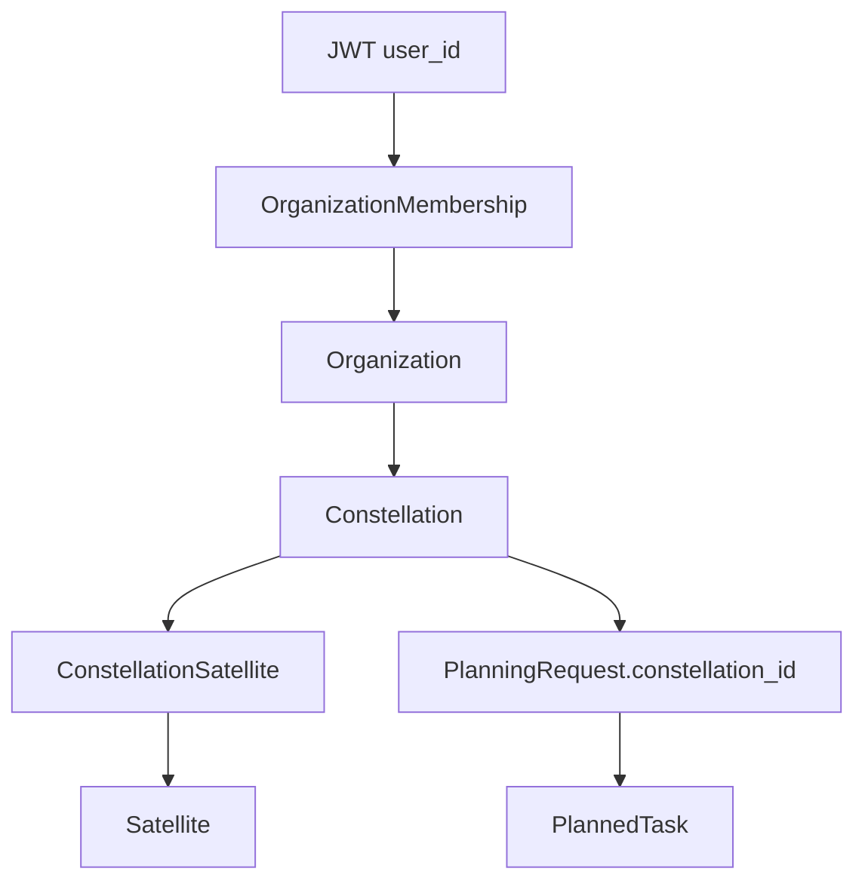
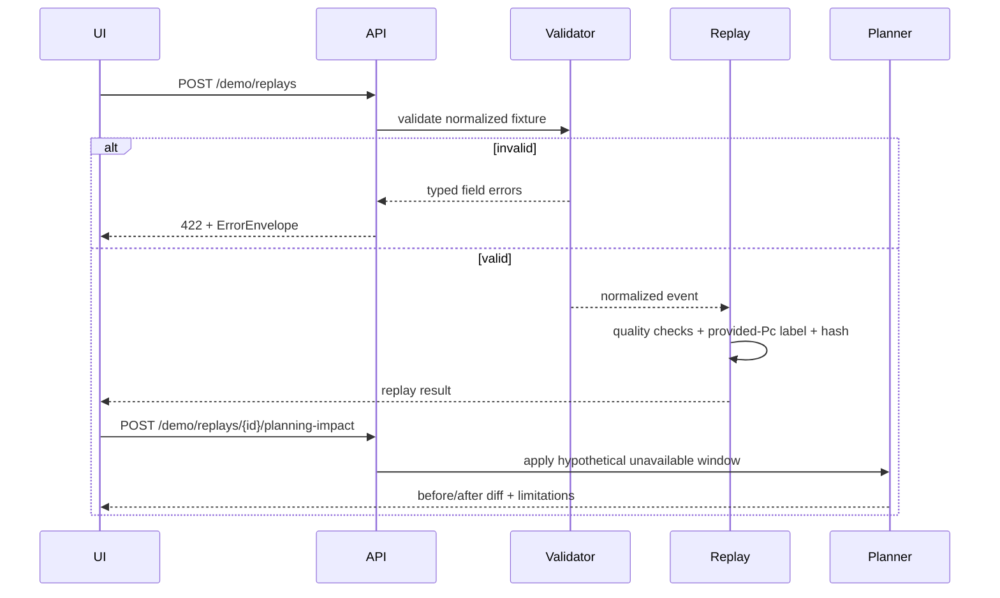
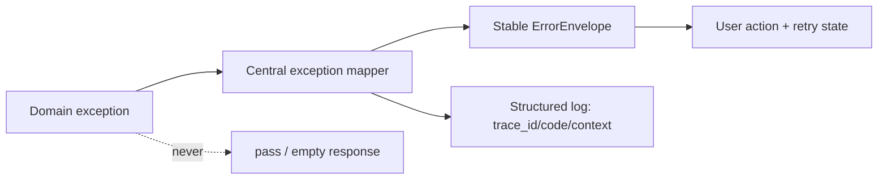
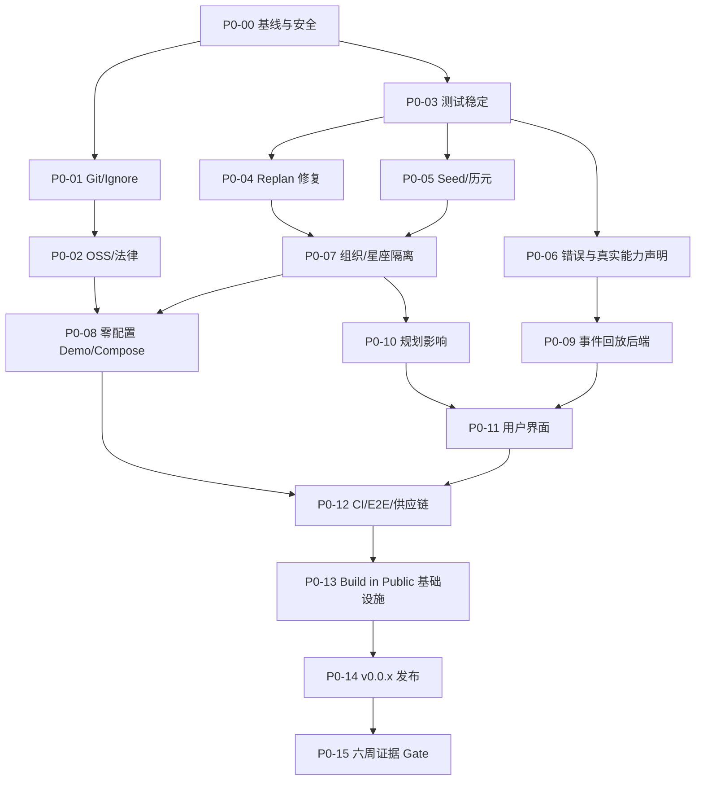
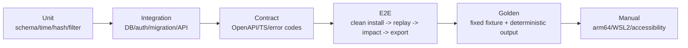
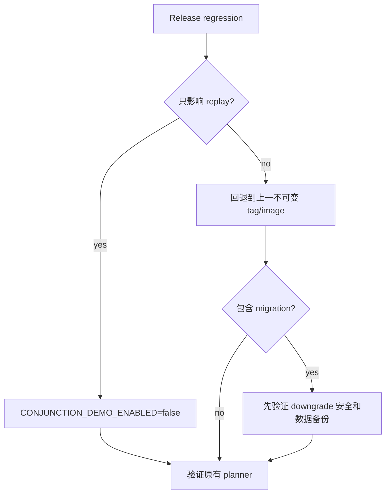

# Apex Phase 0：AI 可执行开发与 Build in Public 验证规范

> 状态：**已批准进入 Phase 0；尚未开始业务代码实现**  
> 版本：1.0  
> 日期：2026-07-23  
> 上位计划：`SSA_OPEN_SOURCE_PRODUCT_AND_DEVELOPMENT_PLAN.md`  
> 适用对象：Codex、Claude Code、Cursor、Gemini CLI、OpenCode 或任何接手本项目的开发 Agent  
> 最短日历周期：6 周。代码准备可以更早完成，但 Market-fit Gate 不得提前伪造或跳过。

---

## 0. 本文怎样使用

本文不是愿望清单，而是 Phase 0 的实施合同。接手的 AI 必须：

1. 完整阅读本文和上位计划。
2. 检查实际文件；不得假设计划中的“当前状态”永远正确。
3. 一次只认领一个任务 ID，满足其依赖后再执行。
4. 先写或确认失败测试，再做最小实现，再运行验收命令。
5. 在任务记录中留下命令、结果、剩余风险和文件清单。
6. 不得因“看起来更先进”扩大范围，不得提前实现自主 Agent、黑盒风险模型或自动机动。

### 0.1 信息冲突时的优先级

从高到低：

1. 用户在当前任务中的明确指令。
2. `SSA_OPEN_SOURCE_PRODUCT_AND_DEVELOPMENT_PLAN.md` 的产品和安全边界。
3. 本文的 Phase 0 验收合同。
4. 已通过的自动化测试和数据库迁移。
5. 实际代码行为。
6. README、注释和旧 PRD。

若 4、5、6 互相矛盾，AI 必须把矛盾变成测试或文档修复，不得选择最方便的说法。

### 0.2 Phase 0 的唯一目标

在不伪装成飞行认证系统的前提下，证明下面的闭环值得继续投资：

```text
干净安装
  -> 演示星座
  -> 合成/可再分发的交会事件
  -> 风险字段与数据质量解释
  -> 假设性不可用时间窗
  -> 原有任务规划影响对比
  -> 可审计导出
  -> 公开用户证据
```

### 0.3 Phase 0 明确不实现

- 不自主抓取或重新分发 Space-Track CDM。
- 不宣称仅凭 TLE 可以给出飞行级碰撞概率。
- 不在 Phase 0 独立计算 Pc；只展示演示输入中明确标注为 `provided` 的 Pc。
- 不计算真实避碰脉冲、燃料消耗或轨道机动后状态。
- 不向卫星、地面站或任务控制系统下发任何指令。
- 不实现 LLM Agent；Agent 在 Phase 3，Phase 0 只固化未来工具契约。
- 不扩展 Rigor 功能。
- 不做全目录 all-on-all 筛查、实时大屏或 3D 地球。
- 不把 stars、浏览量和点赞当作 Market-fit。

---

## 1. 术语与安全标签

所有 UI、API、文档和公开内容必须使用同一组术语。

| 术语 | 精确定义 | 禁止混用 |
|---|---|---|
| `provided Pc` | 输入事件自带的碰撞概率，Apex 只校验、保存和展示 | 不得写成“Apex 计算” |
| `computed Pc` | 由版本化确定性算法和协方差输入复算的 Pc；Phase 1 才实现 | Phase 0 不得返回此标签 |
| 数据质量 | 输入完整性、时效、参考系、单位、协方差和来源可信度 | 不等于风险高低 |
| 风险等级 | 基于明确阈值对风险指标的展示性分级 | 不等于飞行指令 |
| 假设性规划影响 | 把卫星在一段时间内标记不可用后重新规划得到的差异 | 不等于机动轨迹验证 |
| 候选建议 | 供人审查的结构化方案 | 不等于已批准机动 |
| 合成事件 | 为演示和测试创建，不对应真实敏感事件 | 不得描述为真实运营数据 |
| 可审计 | 输入、版本、阈值、输出和哈希可追踪 | 不等于已经过独立认证 |

每个风险页面必须固定显示：

> Research and decision-support software. Not flight-certified. No maneuver is executed by Apex.

中文界面对应：

> 本软件用于研究与决策支持，未经飞行认证；Apex 不会执行任何机动。

---

## 2. 已核实的当前工程基线

以下是 2026-07-23 的检查结果。执行 P0-00 时必须重新核实并记录差异。

### 2.1 已存在且必须保留

| 能力 | 主要文件 | 当前实现 |
|---|---|---|
| FastAPI 服务 | `backend/app/main.py` | Auth、Satellite、Orbit、Planning 路由 |
| 用户认证 | `backend/app/api/v1/auth.py` | 注册、登录、刷新、当前用户 |
| 星座规划核心 | `backend/app/planning/` | 意图解析、成像窗口、CP-SAT、Validator |
| 轨道传播 | `backend/app/orbit/` | Skyfield/SGP4 地面轨迹、过境和成像窗口 |
| 数据库 | `backend/alembic/versions/0001_initial_7_tables.py` | 7 张表 |
| 前端 | `frontend/src/` | 登录、规划页、甘特图、地图、重规划 |
| 本地编排 | `docker-compose.yml` | Postgres、Redis、API、Frontend |
| 测试 | `backend/tests/` | Auth、模型、Schema、Orbit、Planning |

### 2.2 已核实的阻断问题

| ID | 问题 | 证据位置 | 影响 |
|---|---|---|---|
| B-01 | 当前目录不是 Git 工作树 | 根目录检查 | 无法做可信版本、Release 和贡献流程 |
| B-02 | 根目录没有开源许可证，README 声称 Proprietary | `README.md` | 不满足开源条件 |
| B-03 | Quickstart 要手工 `.env`、迁移、Seed | `.env.example`, `docker-compose.yml`, `README.md` | 不能开箱即用 |
| B-04 | `/satellites` 和 planner 查询全部卫星 | `satellites.py`, `planner.py` | 跨用户数据泄露与错误规划 |
| B-05 | replan 后台闭包读取后又局部赋值 `req` | `planning.py` | `UnboundLocalError` 被静默吞掉 |
| B-06 | Seed 用 `cfg.pop` 修改全局配置 | `seed_satellites.py` | 第二次运行不可预测 |
| B-07 | Seed 用当前时间冒充 TLE 历元 | `seed_satellites.py` | 轨道来源不可审计 |
| B-08 | 后台任务捕获宽泛异常并丢失错误 | `planning.py` | 用户看到假成功或永远等待 |
| B-09 | README 声称 Celery，代码实际使用 `BackgroundTasks` | README、依赖、API | 架构事实不一致 |
| B-10 | 完整后端测试在 Orbit/Imaging 路径卡住 | 既有测试运行记录 | CI 不确定 |
| B-11 | Ruff 有 72 个发现 | 既有 Lint 记录 | 基线不干净 |
| B-12 | 前端有 Vitest 依赖但没有测试文件 | `frontend/package.json`, `frontend/src` | UI 无回归保护 |
| B-13 | Planner 文档声称的部分物理约束并未真正建模 | `solver.py`, `validator.py` | 可能误导用户 |
| B-14 | `backend/de421.bsp` 来源和再分发权未证明 | 二进制文件 | 公开发布法律风险 |
| B-15 | 生成物已存在于目录 | `frontend/dist`, `backend/htmlcov`, `__pycache__`, `*.tsbuildinfo` | 初始提交可能污染 |
| B-16 | 前端 `PlannedTask.satellite_id` 与后端 `PlannedTaskOut` 不一致 | 前后端 types/schemas | UI 依赖未声明字段 |
| B-17 | `/planning/parse` 文档称 stateless，实际创建数据库记录 | `planning.py` | API 语义和数据增长不可信 |
| B-18 | Cancel 只改状态，不能阻止已启动后台任务随后写回 | `planning.py` | cancelled 可能被覆盖为 ready |
| B-19 | 测试 auth fixture 把 email 放进 JWT `sub`，生产代码期望 UUID | `backend/tests/conftest.py`, `dependencies.py` | 测试契约分裂 |

### 2.3 当前可复用但需约束的设计

- 保留 PostgreSQL、FastAPI、React、SQLAlchemy、Alembic 和 OR-Tools。
- 保留现有 `Satellite` 作为 Phase 0 的规划资源/演示目录记录；Phase 1 再拆分 `SpaceObject`、`OrbitSolution` 和用户资产。
- Redis 在 Phase 0 不是必需运行条件。若无实际消费者，应从默认 Compose 移出或标记 optional，而不是假装存在任务队列。
- LLM 不得成为默认 Demo 依赖。意图解析必须有本地规则路径，外部模型只做可选增强。
- `BackgroundTasks` 只适合单进程本地 Demo。生产部署在 Phase 0 必须明确标为 unsupported，而不是悄悄用四个 Gunicorn Worker 假装任务可靠。

---

## 3. Phase 0 目标架构

### 3.1 组件关系



### 3.2 Quickstart 启动数据流



任何迁移或 Seed 失败都必须阻止 API 进入 ready；不得在日志中报错后继续返回“健康”。

### 3.3 用户与星座隔离流



约束：

- 用户只有通过 `OrganizationMembership` 才能访问 Organization。
- Constellation 必须属于 Organization。
- Satellite 只有通过 `ConstellationSatellite` 才会进入该星座的 planner。
- `PlanningRequest.user_id` 记录发起者，`constellation_id` 记录资源范围。
- 不得接受客户端传入的 organization ID 后直接信任；必须从当前用户成员关系校验。

### 3.4 演示事件回放流



### 3.5 错误传播



---

## 4. 固定工程契约

这些契约在 Phase 0 内视为已经决定。若执行中确实不可行，必须新增 ADR，而不是悄悄改变。

### 4.1 运行模式

新增配置：

| 变量 | 允许值 | 默认 | 行为 |
|---|---|---|---|
| `APP_ENV` | `demo`, `development`, `test`, `production` | `demo` in Compose | 决定安全校验与日志 |
| `DEMO_MODE` | `true`, `false` | `true` in default Compose | 是否允许自动演示用户和合成 fixture |
| `DATABASE_URL` | SQLAlchemy URL | Compose 生成 | 单一数据库入口 |
| `JWT_SECRET` | 非空字符串 | demo 使用仓库内明确标注的非生产值 | production 检测默认值必须拒绝启动 |
| `LLM_PROVIDER` | `none`, `openai`, `compatible`, `local` | `none` | Phase 0 固定 `none` |
| `CONJUNCTION_DEMO_ENABLED` | boolean | `true` in demo | 回滚演示垂直切片 |

生产模式必须拒绝：

- 默认 JWT secret。
- `DEMO_MODE=true`。
- 空数据库密码。
- Debug/reload。
- 自动创建演示用户。

### 4.2 标准命令

Phase 0 完成后必须存在：

```bash
make demo          # 等价于默认 Compose Quickstart
make verify        # lint + typecheck + unit + integration + frontend test
make test          # 所有不需要浏览器的测试
make test-e2e      # Playwright 最小用户旅程
make reset-demo    # 只重置命名明确的 Compose demo volume
make release-check # license + clean tree + build + fixture hash + docs links
```

约束：

- 命令应在 macOS/Linux 使用 POSIX shell。
- `make reset-demo` 必须先打印确切 volume 名称，不得对未解析变量、`~`、工作区根目录执行删除。
- CI 调用与 README 完全相同的命令，禁止另建只在 CI 有效的隐藏路径。

### 4.3 健康接口

| 接口 | 含义 | 成功条件 |
|---|---|---|
| `GET /health/live` | 进程存活 | 事件循环可响应；不访问外部网络 |
| `GET /health/ready` | 可接收请求 | DB 可查询、迁移为 head、demo bootstrap 已完成 |
| `GET /api/v1/demo/status` | Demo 可用 | 返回 fixture、星座和演示用户的稳定 ID 与版本 |

`/health` 可暂时保留为兼容别名，但 README 和 Compose 只使用 `/health/ready`。

### 4.4 统一错误格式

现有 `ErrorResponse` 与 FastAPI 的 `{"detail": ...}` 不一致。Phase 0 统一为：

```json
{
  "error": {
    "code": "CONSTELLATION_FORBIDDEN",
    "message": "You do not have access to this constellation.",
    "details": {"constellation_id": "..."},
    "retryable": false,
    "trace_id": "uuid"
  }
}
```

最低错误码集合：

| 错误码 | HTTP | retryable | 用户动作 |
|---|---:|---:|---|
| `AUTH_INVALID_CREDENTIALS` | 401 | false | 重新登录 |
| `ORGANIZATION_FORBIDDEN` | 403 | false | 选择有权限的组织 |
| `CONSTELLATION_REQUIRED` | 400 | false | 选择星座 |
| `CONSTELLATION_FORBIDDEN` | 403 | false | 不暴露资源是否存在 |
| `PLANNING_NO_ELIGIBLE_ASSETS` | 422 | false | 修改星座或约束 |
| `PLANNING_TIMEOUT` | 503 | true | 缩短时间窗或重试 |
| `DEMO_FIXTURE_INVALID` | 500 | false | 仓库 fixture 损坏，提交 Issue |
| `EVENT_INPUT_INVALID` | 422 | false | 修正字段和单位 |
| `EVENT_COVARIANCE_MISSING` | 200 | false | 结果中降级数据质量，不伪造 Pc |
| `DEMO_BOOTSTRAP_FAILED` | 503 | true | 查看 bootstrap 日志 |
| `LLM_UNAVAILABLE` | 503 | true | 使用本地规则路径 |

未知异常返回 `INTERNAL_ERROR`，日志保留堆栈，响应不得泄露 secret、数据库 URL 或原始受限数据。

### 4.5 Phase 0 数据模型

在 `0002_phase0_tenancy.py` 中新增：

#### `organizations`

| 字段 | 类型 | 约束 |
|---|---|---|
| `id` | UUID | PK |
| `slug` | varchar(80) | unique, non-null, lowercase |
| `name` | varchar(160) | non-null |
| `created_at` | timestamptz | non-null |
| `updated_at` | timestamptz | non-null |

#### `organization_memberships`

| 字段 | 类型 | 约束 |
|---|---|---|
| `organization_id` | UUID | FK, composite PK |
| `user_id` | UUID | FK, composite PK |
| `role` | varchar(20) | `owner`, `operator`, `viewer` |
| `created_at` | timestamptz | non-null |

#### `constellations`

| 字段 | 类型 | 约束 |
|---|---|---|
| `id` | UUID | PK |
| `organization_id` | UUID | FK, non-null, indexed |
| `slug` | varchar(80) | unique within organization |
| `name` | varchar(160) | non-null |
| `description` | text | nullable |
| `is_demo` | boolean | default false |
| `created_at`, `updated_at` | timestamptz | non-null |

#### `constellation_satellites`

| 字段 | 类型 | 约束 |
|---|---|---|
| `constellation_id` | UUID | FK, composite PK |
| `satellite_id` | UUID | FK, composite PK |
| `display_name` | varchar(160) | nullable |
| `enabled` | boolean | default true |
| `created_at` | timestamptz | non-null |

#### 现有表变更

- `planning_requests.constellation_id`: UUID FK，迁移阶段先 nullable，回填后改 non-null。
- 保留 `planning_requests.user_id` 作为 actor。
- Phase 0 不删除或重命名 `satellites` 字段。

迁移回填规则：

1. 创建 `apex-demo` Organization。
2. 创建 `demo-constellation`。
3. 把已有 Satellite 作为 demo constellation 的成员；不改变其 NORAD ID。
4. 为已有 User 创建 personal Organization 和 owner membership。
5. 历史 PlanningRequest 若使用 demo seed 资产，指向 demo constellation；无法证明来源的记录不自动归属个人组织，记录迁移警告。
6. upgrade/downgrade 都必须在 PostgreSQL 测试；SQLite 单元测试不能代替迁移测试。

### 4.6 Phase 0 API

保留现有路径，增加范围参数与新路径：

| 方法与路径 | Auth | 输入 | 输出/约束 |
|---|---|---|---|
| `GET /api/v1/organizations` | required | none | 当前用户可访问组织 |
| `GET /api/v1/constellations` | required | optional `organization_id` | 只返回成员可访问数据 |
| `POST /api/v1/constellations` | owner/operator | `organization_id`, `name`, `slug` | 创建空星座 |
| `GET /api/v1/constellations/{id}` | required | id | 无权限统一 403 |
| `PATCH /api/v1/constellations/{id}` | owner/operator | mutable name/description | slug 变更需显式规则 |
| `GET /api/v1/constellations/{id}/satellites` | required | id | 返回 membership 和 Satellite 摘要 |
| `POST /api/v1/constellations/{id}/satellites` | owner/operator | existing `satellite_id` | 幂等 attach |
| `DELETE /api/v1/constellations/{id}/satellites/{satellite_id}` | owner/operator | ids | 只删除 link，不删全局 Satellite |
| `GET /api/v1/satellites?constellation_id=` | required | constellation UUID | 仅返回成员卫星 |
| `POST /api/v1/planning/parse` | required | `raw_input`, `constellation_id` | parser 上下文只含该星座 |
| `POST /api/v1/planning/requests` | required | `raw_input`, `constellation_id` | planner 只用该星座 |
| `GET /api/v1/demo/status` | none in demo | none | 版本和可用性，不返回密码 |
| `POST /api/v1/demo/session` | none in demo | none | 返回短期 demo token；production 404 |
| `POST /api/v1/demo/replays` | demo token | optional fixture id | 创建可重复回放结果 |
| `POST /api/v1/demo/replays/{id}/planning-impact` | demo token | unavailable window | 前后规划差异 |
| `GET /api/v1/demo/replays/{id}/export` | demo token | `format=json|md` | 证据包 |

兼容行为：

- 用户只有一个可访问星座时，旧 Planning API 可临时选择该星座，并返回 `Deprecation` header。
- 用户有零个或多个星座且未传 `constellation_id` 时返回 `CONSTELLATION_REQUIRED`，不得取全库。
- `satellite_swap` Schema 当前前端是 `string[]`、后端是 `string`，P0-04 必须统一为单个 `satellite_id: string | null`。

### 4.7 合成事件 Fixture

文件：

```text
fixtures/demo/conjunction/apex-synthetic-001/
  event.json
  expected-replay.json
  LICENSE.md
  README.md
```

`event.json` 最小 Schema：

```json
{
  "schema_version": "apex.demo.conjunction.v1",
  "event_id": "APEX-SYNTHETIC-001",
  "provenance": {
    "kind": "synthetic",
    "license": "CC0-1.0",
    "created_by": "Apex maintainers",
    "source_url": null
  },
  "created_at_utc": "2024-05-31T12:00:00Z",
  "tca_utc": "2024-06-01T12:00:00Z",
  "primary": {
    "catalog_id": "100001",
    "name": "APEX-DEMO-PRIMARY"
  },
  "secondary": {
    "catalog_id": "100002",
    "name": "APEX-DEMO-SECONDARY"
  },
  "relative_state": {
    "miss_distance_m": 245.0,
    "relative_speed_m_s": 14250.0
  },
  "risk": {
    "collision_probability": 0.00012,
    "source": "provided",
    "method": "synthetic_demo_value"
  },
  "covariance": {
    "available": false,
    "reference_frame": null
  },
  "limitations": [
    "Synthetic event",
    "Pc is supplied by the fixture and is not computed by Apex",
    "No maneuver trajectory is generated"
  ]
}
```

规则：

- catalog ID 必须使用字符串，并覆盖 6 位编号测试。
- 所有时间必须是带 `Z` 的 UTC；内部使用 timezone-aware datetime。
- 单位写入字段名或明确 unit metadata，不接受隐式 km/m 混用。
- `collision_probability` 允许范围 `[0, 1]`。
- `tca_utc` 必须晚于 `created_at_utc`。
- `covariance.available=false` 时质量结果必须指出不能独立复算 Pc。
- Fixture 哈希使用 canonical JSON（UTF-8、排序键、无非语义空白）的 SHA-256。
- `expected-replay.json` 固定预期等级、警告、标签和哈希，作为黄金测试。

### 4.8 假设性规划影响

输入：

```json
{
  "constellation_id": "uuid",
  "satellite_id": "uuid",
  "unavailable_from_utc": "2024-06-01T11:30:00Z",
  "unavailable_to_utc": "2024-06-01T12:30:00Z",
  "reason": "synthetic_conjunction_what_if"
}
```

实现原则：

- 在生成 `ImagingWindowData` 后、进入 CP-SAT 前过滤与不可用窗重叠的窗口。
- 不把 unavailable window 描述成轨道机动结果。
- 输出 before/after 使用相同输入、相同 solver seed、相同时间基准。
- Phase 0 必须固定评估时刻，不得每次用 `datetime.utcnow()` 导致黄金输出漂移。
- Demo Satellite 的 TLE/OMM 历元必须与固定评估时刻在已声明的允许年龄范围内；若不满足，发布检查失败，不能用“合成事件”掩盖过期轨道输入。

输出至少包含：

- 原计划任务数、新计划任务数。
- 保留、移除、重新分配的任务 ID。
- 目标函数差异。
- 受影响时间窗。
- Solver 状态和耗时。
- `physics_verified=false`。
- 限制说明。

---

## 5. 工作流、依赖与并行边界

### 5.1 依赖图



### 5.2 可并行工作

| Lane | 任务 | 可以并行的条件 | 合并前共同 Gate |
|---|---|---|---|
| A 仓库与法律 | P0-01, P0-02 | P0-00 完成 | LICENSE 和资产清单一致 |
| B 可靠性 | P0-03, P0-04, P0-05, P0-06 | 各自测试文件不冲突 | `make test` |
| C 领域隔离 | P0-07 | P0-04/P0-05 完成 | PostgreSQL migration + authz tests |
| D 演示垂直切片 | P0-09, P0-10 | P0-06/P0-07 完成，Schema 先冻结 | golden fixture tests |
| E UI/DX | P0-08, P0-11 | API contract 冻结 | Playwright journey |
| F 发布/验证 | P0-12 至 P0-15 | 所有代码 Lane 完成 | release checklist |

不得并行：

- P0-07 migration 与任何依赖旧数据库 Schema 的业务分支。
- P0-09 fixture Schema 和 P0-11 前端类型定义，除非先提交 API contract。
- P0-14 Release 与 P0-12 质量 Gate。

---

## 6. 任务清单

每个任务完成时，在 PR 或 `docs/development/phase0-log.md` 增加：

```text
Task:
Commit:
Changed files:
Commands run:
Result:
Acceptance evidence:
Known limitations:
Next unblocked tasks:
```

### P0-00：冻结范围并建立可复现基线

**依赖**：无  
**目标**：确保后续 AI 不覆盖用户文件、不误删生成物、不把旧文档当事实。

**读取**：

- 根目录所有 `*.md`
- `Makefile`, `docker-compose*.yml`, `.env.example`
- `backend/pyproject.toml`, `frontend/package.json`
- 全部 `backend/app`, `backend/tests`, `frontend/src`

**新增**：

- `docs/development/BASELINE.md`
- `docs/development/phase0-log.md`

**步骤**：

1. 记录操作系统、CPU 架构、Docker/Compose/Python/Node 版本。
2. 记录目录不是 Git 仓库这一事实；不要假造 commit SHA。
3. 列出生成物、二进制、疑似 secret、超大文件和用户输出目录。
4. 运行现有后端测试，给每组测试设置外部超时并单独记录。
5. 运行 Ruff、Mypy、前端 build、frontend test。
6. 把“通过、失败、卡住、未配置”分开记录，不能只写总分。
7. 不在本任务修复缺陷。

**验收**：

- 文档包含每条命令、退出码和运行时间。
- 卡住的测试精确到文件/测试名。
- 没有业务代码变更。
- 没有删除 `outputs/`、演示文稿或用户内容。

### P0-01：Git、忽略规则与干净初始历史

**依赖**：P0-00  
**目标**：形成可公开审查的源代码边界。

**新增/修改**：

- `.gitignore`
- `.gitattributes`
- `.editorconfig`
- 可选 `.dockerignore`（根、backend、frontend）

**忽略至少包括**：

- `.env`, `.env.*`，但保留 `.env.example`
- `__pycache__/`, `*.py[cod]`, `.pytest_cache/`, `.mypy_cache/`, `.ruff_cache/`
- `.coverage`, `htmlcov/`
- `node_modules/`, `dist/`, `*.tsbuildinfo`
- IDE/OS 生成物

**步骤**：

1. 先写 ignore，再执行 `git init -b main`。
2. 检查 `git status --ignored`；确认源文件没有被误忽略。
3. 生成物只有在 P0-00 证明可再生成后才可从工作目录清理。
4. `outputs/` 默认保留且不自动提交；由仓库所有者决定是否迁移到 Release assets。
5. 初始提交前运行 secret scan。

**验收**：

- `git status --short` 不包含 secret、cache、dist、coverage。
- 初始提交只包含可维护源文件和明确允许的资产。
- GitHub remote、组织名和仓库可见性由用户设置；AI 不擅自创建公开仓库。

### P0-02：开源许可、治理与数据来源

**依赖**：P0-01  
**目标**：公开后使用者明确知道可以怎样用、贡献和报告问题。

**默认决定**：Apache-2.0。若仓库所有者在首次公开 Release 前明确改为其他 OSI 许可证，再写 ADR。

**新增**：

- `LICENSE`
- `NOTICE`
- `CONTRIBUTING.md`
- `CODE_OF_CONDUCT.md`
- `SECURITY.md`
- `GOVERNANCE.md`
- `CHANGELOG.md`
- `docs/legal/THIRD_PARTY_ASSETS.md`
- `docs/legal/DATA_AND_MODEL_POLICY.md`
- `docs/architecture/ADR-0001-license.md`

**修改**：

- README 删除 Proprietary。
- 每个 fixture 附许可证和 provenance。

**步骤**：

1. 枚举 Python/Node 直接与传递依赖许可证。
2. 枚举字体、图片、地图瓦片、星历、TLE/CDM 和输出样例。
3. 对 `backend/de421.bsp` 查来源、版本、哈希和再分发条款。
4. 不能证明的资产从公开发布包排除；代码应支持用户运行时自行获取。
5. Space-Track 适配器只允许 BYO credentials，日志不得记录凭据或受限原文。
6. CelesTrak 客户端设计必须缓存并遵守一次/更新周期的使用政策；Phase 0 不默认联网。
7. 采用 DCO `Signed-off-by`，不要求 CLA 转让版权。

**验收**：

- GitHub Community Profile 必备文件齐全。
- `THIRD_PARTY_ASSETS.md` 中每项都有 `source/license/redistributable/hash/action`。
- 无来源资产不在容器和 Release 包内。
- LICENSE 检查在 CI 可运行。

### P0-03：让测试确定地完成

**依赖**：P0-00  
**目标**：所有测试都有上限时间，失败可定位。

**重点文件**：

- `backend/tests/orbit/test_imaging.py`
- `backend/tests/orbit/test_propagation.py`
- `backend/app/orbit/imaging.py`
- `frontend/vitest.config.ts`
- `frontend/src/**/*.test.tsx`

**步骤**：

1. 单独复现卡住用例，记录调用参数和热点。
2. 优先修正无界时间窗、步长、网络依赖或昂贵 fixture；不得简单删除测试。
3. 测试统一使用固定时刻和固定 TLE/OMM。
4. 对 Orbit 单元测试设置合理内部上限；CI 再加外部 timeout。
5. 前端增加 App 路由、Login、Planning happy/error/loading 最小测试。
6. 将测试标为 unit/integration/e2e，默认 `make test` 不访问公网。

**验收**：

- 后端完整测试在开发机 120 秒内结束。
- 单个 Orbit 测试不超过 10 秒，除非明确标为 slow。
- 前端不再报告“no test files”。
- 重复运行三次无随机失败。

### P0-04：修复 Replan、后台任务和前后端契约

**依赖**：P0-03  
**目标**：Replan 不再假成功、吞异常或使用不一致 Schema。

**修改**：

- `backend/app/api/v1/planning.py`
- `backend/app/schemas/planning.py`
- `frontend/src/lib/api.ts`
- `frontend/src/types/index.ts`
- `frontend/src/components/planning/ReplanModal.tsx`

**测试**：

- `backend/tests/api/test_planning_replan.py`
- `frontend/src/components/planning/ReplanModal.test.tsx`

**步骤**：

1. 在闭包外只捕获不可变的 `request_id`, `raw_input`, `current_intent`。
2. 后台 session 中使用新变量 `db_request`，禁止复用 `req`。
3. 捕获异常后写 `planning_error` 和稳定错误码/摘要；保留结构化日志。
4. 不在异常分支 `pass`。
5. 统一 `satellite_swap` 为单个 nullable UUID，或删去尚未实现的字段；前后端一致。
6. 定义状态转换：`ready|partial|failed -> planning -> ready|partial|planning_error`。
7. 幂等：同一 request 同时只有一个 replan；冲突返回 409。
8. 后台任务在写入前重新读取状态；若为 `cancelled`，必须停止并且不得覆盖状态。
9. 统一 JWT 测试 fixture 与生产契约，`sub` 固定为 User UUID。
10. 决定 `/parse` 的单一语义：推荐改为真正 stateless，不创建 draft；若保留 draft，则改名并在 OpenAPI 明示。
11. 统一 `PlannedTaskOut` 与前端类型：必须包含经过权限校验的 `satellite_id` 和 `satellite_name`，或前后端同时删除依赖。

**验收用例**：

- 正常 replan 更新任务。
- solver 抛异常时状态为 `planning_error`，日志有 trace ID。
- 被取消请求返回 409。
- 其他用户请求返回 404 或 403，且不泄露内容。
- 双击 replan 不创建重复任务。
- cancel 与后台完成竞态时，最终状态仍为 `cancelled`。
- `/parse` 重复调用不会产生未声明的数据库记录。

### P0-05：修复 Seed、时间和轨道来源

**依赖**：P0-03  
**目标**：Seed 幂等、可审计、不会伪造历元。

**修改**：

- `backend/app/scripts/seed_satellites.py`
- 新增 `backend/app/orbit/tle.py`
- 新增 `backend/tests/scripts/test_seed_satellites.py`
- 新增 `backend/tests/orbit/test_tle_epoch.py`

**步骤**：

1. 用复制或解构代替 `cfg.pop`，输入常量永不修改。
2. 从 TLE line 1 解析 YYDDD.DDDDDDDD 历元，处理 57/00 世纪规则并写测试。
3. 所有数据库时间改为 timezone-aware UTC；不要混用 `utcnow()` naive。
4. Seed 以稳定业务键 upsert，重复两次行数与内容不变。
5. 记录 fixture 来源、获取日期、哈希和许可证。
6. 新 catalog ID 使用字符串，增加 6 位编号用例；OMM 是后续默认导入格式，TLE 为兼容格式。
7. Demo 时间由 seed metadata 指定，并与 demo 轨道历元一起接受 age check；禁止随系统当前日期漂移。

**验收**：

- 同一 Seed 连续运行两次结果相同。
- `tle_epoch` 等于 TLE 内容，不等于运行时刻。
- 6 位 catalog ID 不被截断或转成整数。
- 无网络时 Seed 成功。

### P0-06：错误可见性与能力声明校正

**依赖**：P0-03  
**目标**：系统只声称真实实现的能力。

**修改**：

- `backend/app/schemas/common.py`
- 新增 `backend/app/core/errors.py`
- `backend/app/main.py`
- `backend/app/planning/solver.py`
- `backend/app/planning/validator.py`
- README/架构文档

**步骤**：

1. 实现统一 `ErrorEnvelope` 和中央 exception handlers。
2. 替换核心路径宽泛静默捕获；允许边界层捕获后映射。
3. 日志包含 `timestamp, level, trace_id, error_code, route`；不含 token/密码。
4. 更正文档：当前 solver 真正实现的是 assignment、overlap、简化 power/storage；turn rate/downlink 只是近似警告。
5. 在 UI 将“Physics validated”改为与实际一致的“Constraint checks”，并列出未建模项。
6. 设置 CP-SAT 时间上限和 `unknown`/timeout 行为。

**验收**：

- 每个错误码有 API 测试。
- 未知异常不返回堆栈。
- README、OpenAPI 和代码行为一致。
- 没有“flight safe”“physics verified”等未经证实词语。

### P0-07：组织、星座和资产隔离

**依赖**：P0-04, P0-05, P0-06  
**目标**：保留原有星座管理方向，同时消除全库查询。

**新增/修改**：

- `backend/app/models/organization.py`
- `backend/app/models/organization_membership.py`
- `backend/app/models/constellation.py`
- `backend/app/models/constellation_satellite.py`
- `backend/app/models/__init__.py`
- `backend/alembic/versions/0002_phase0_tenancy.py`
- `backend/app/schemas/organization.py`
- `backend/app/schemas/constellation.py`
- `backend/app/api/v1/organizations.py`
- `backend/app/api/v1/constellations.py`
- `backend/app/api/v1/satellites.py`
- `backend/app/planning/planner.py`
- `backend/app/api/v1/planning.py`

**测试**：

- `backend/tests/migrations/test_0002_phase0_tenancy.py`
- `backend/tests/api/test_constellation_authorization.py`
- `backend/tests/planning/test_planner_scope.py`

**步骤**：

1. 按 4.5 建模和迁移。
2. 注册时事务内创建 personal Organization、owner membership、默认 constellation。
3. Demo bootstrap 创建 demo Organization/constellation/asset links。
4. 建立一个 `require_constellation_access` dependency/service；路由不得各写一套权限逻辑。
5. planner 签名增加 `constellation_id` 或明确的 Satellite 列表，删除内部全库查询。
6. Satellite detail、overpass、ground-track 都校验其属于可访问 constellation。
7. 非成员访问不要返回资源名称、成员或存在性细节。

**验收矩阵**：

| 场景 | 预期 |
|---|---|
| Org A 用户列举 Org A 星座 | 200 |
| Org A 用户列举 Org B 星座 | 403/不可见 |
| Org A planner | 只使用 A 的资产 |
| 无星座用户创建计划 | `CONSTELLATION_REQUIRED` |
| Demo 用户 | 看到且只看到 demo constellation |
| Viewer 修改星座 | 403 |
| Operator 发起规划 | 允许 |
| Operator attach/detach 已有 Satellite | 允许且不删除全局目录记录 |
| 同一 Satellite 重复 attach | 幂等，不产生重复 link |

### P0-08：零配置 Demo 与 Compose

**依赖**：P0-02, P0-07  
**目标**：一条命令、五分钟内、无 Key。

**修改/新增**：

- `docker-compose.yml`
- `backend/Dockerfile`
- `frontend/Dockerfile`
- `.env.example`
- `Makefile`
- `backend/app/core/config.py`
- `backend/app/scripts/bootstrap_demo.py`
- `backend/tests/integration/test_demo_bootstrap.py`

**步骤**：

1. 默认 Compose 不依赖本地 `.env` 文件存在。
2. 增加一次性 `migrate`/`bootstrap` service；只有成功后启动 API。
3. 增加 API 和 frontend healthcheck。
4. 默认 `LLM_PROVIDER=none`，规则 parser 可用。
5. Redis 若无消费者，从 default profile 移到 `optional` profile。
6. Demo session 使用临时 token，不在 README 暴露永久密码。
7. `bootstrap_demo.py` 幂等并输出稳定 demo IDs。
8. production Compose 移除未被可靠队列支持的多 worker 背景任务声明，或明确禁止异步规划生产使用。

**验收**：

```bash
docker compose down --volumes
docker compose up --build --wait
curl --fail http://localhost:8000/health/ready
curl --fail http://localhost:8000/api/v1/demo/status
```

- 在干净缓存条件下 5 分钟内 ready；记录硬件与网络条件。
- 无 `.env`、无 OpenAI Key、无 Space-Track 账号。
- 第二次启动不重复 Seed。
- migration 失败时 API 不 ready。

### P0-09：合成事件回放后端

**依赖**：P0-06, P0-07  
**目标**：用诚实、可复算的最小垂直切片测试用户是否需要“风险 + 证据”。

**新增**：

- `fixtures/demo/conjunction/apex-synthetic-001/*`
- `backend/app/conjunction/schemas.py`
- `backend/app/conjunction/quality.py`
- `backend/app/conjunction/replay.py`
- `backend/app/conjunction/evidence.py`
- `backend/app/api/v1/demo.py`
- `backend/tests/conjunction/test_demo_fixture.py`
- `backend/tests/conjunction/test_quality.py`
- `backend/tests/conjunction/test_replay_golden.py`
- `backend/tests/api/test_demo_replay.py`

**步骤**：

1. 实现 4.7 的严格 Pydantic Schema，拒绝额外字段或显式记录扩展。
2. 质量检查：时间、单位、ID、Pc 范围、协方差、来源、fixture 许可证。
3. 风险分级阈值放入版本化配置，不硬编码在 UI。
4. 回放输出始终包含 `pc_origin=provided` 和 `apex_computed_pc=false`。
5. canonical JSON + SHA-256。
6. JSON/Markdown 导出包含输入摘要、限制、版本、阈值和哈希。
7. Phase 0 不持久化用户上传真实 CDM；只允许仓库合成 fixture。
8. Replay ID 从 `fixture_id + fixture_version + replay_algorithm_version` 确定性生成；API 根据 fixture 重算，不增加数据库 replay 表。

**验收**：

- Golden 输出逐字段稳定。
- 修改任一输入字段会改变 evidence hash。
- 缺协方差不报计算错误，而是降级质量并解释。
- 错误单位、时间、Pc 范围返回 typed error。
- 输出中没有任何“computed by Apex”的 Pc 声明。

### P0-10：假设性不可用窗与规划影响

**依赖**：P0-07, P0-09  
**目标**：验证项目的核心差异化——风险事件是否需要与任务规划联动。

**修改/新增**：

- `backend/app/planning/solver_types.py`
- `backend/app/planning/planner.py`
- `backend/app/planning/impact.py`
- `backend/app/api/v1/demo.py`
- `backend/tests/planning/test_unavailable_windows.py`
- `backend/tests/planning/test_planning_impact.py`

**步骤**：

1. 为 planner 增加显式 `evaluation_time_utc`，Demo 使用 fixture 固定时刻。
2. 增加 `UnavailableWindow` 类型，校验开始早于结束、UTC、卫星属于星座。
3. 在求解前过滤重叠窗口；记录被过滤原因。
4. 用相同 solver 配置分别生成 before/after。
5. 对任务集合做稳定 diff，不依赖数组顺序。
6. 输出 limitations 和 `physics_verified=false`。

**验收**：

- 不可用窗不重叠时 before/after 相同。
- 完全覆盖任务窗时任务被移除或重新分配。
- 其他星座卫星不可用窗返回 403。
- 同一输入重复运行结果和 hash 相同。
- Solver timeout 明确返回 partial/error，不假装 optimal。

### P0-11：以用户决策为中心的前端

**依赖**：P0-08, P0-09, P0-10  
**目标**：用户 5 分钟内完成回放并解释结果，不需要先理解 SSA 全部术语。

**新增/修改**：

- `frontend/src/pages/DemoReplayPage.tsx`
- `frontend/src/pages/ConstellationsPage.tsx`
- `frontend/src/components/constellations/ConstellationSelector.tsx`
- `frontend/src/components/constellations/ConstellationAssets.tsx`
- `frontend/src/components/conjunction/EventSummary.tsx`
- `frontend/src/components/conjunction/RiskAndQuality.tsx`
- `frontend/src/components/conjunction/EvidencePanel.tsx`
- `frontend/src/components/conjunction/PlanningImpact.tsx`
- `frontend/src/components/conjunction/LimitationsBanner.tsx`
- `frontend/src/lib/api.ts`
- `frontend/src/types/index.ts`
- `frontend/src/App.tsx`
- 对应 `*.test.tsx`

**页面信息顺序**：

1. 这是合成事件，能做什么/不能做什么。
2. TCA、miss distance、relative speed、provided Pc。
3. 数据质量与缺失协方差，和风险并列但分开。
4. 原始字段与来源。
5. 运行假设性规划影响。
6. before/after 任务差异。
7. 下载 evidence JSON/Markdown。
8. “这对你的真实工作流有用吗？”公开反馈入口。

星座管理的最低保留/增强范围：

- 在 Planner 和 Demo 顶部选择当前 constellation。
- 查看当前 constellation 的 Satellite。
- owner/operator 可创建 constellation，并 attach/detach 已有 demo/catalog Satellite。
- viewer 只能查看。
- Phase 0 不提供真实轨道文件上传；Phase 1 的 OrbitSolution 导入再开放。

**UX 规则**：

- 不用红色单独表示风险；同时使用文本和图标。
- 概率同时显示科学计数和易读值，避免只显示百分比四舍五入为 0。
- 所有时间明确 `UTC`。
- loading、empty、invalid、backend unavailable 都有下一步。
- 首屏不强迫用户输入 OpenAI Key。
- 3D 地球不是 Phase 0 依赖。

**验收任务**：

- 新用户无需文档陪同即可找到 Demo。
- 原有 Planning 页面继续工作，并且只使用当前选择的 constellation。
- 用户可以创建星座、关联已有 Satellite，再用该星座发起规划。
- 能回答：什么时候交会、哪个值是 provided、缺了什么、计划影响是什么、Apex 没做什么。
- 键盘可操作，文本对比度满足 WCAG AA 的基本检查。
- 375px、768px、1440px 不出现横向截断。

### P0-12：CI、E2E 与供应链

**依赖**：P0-08, P0-11  
**目标**：GitHub 上每次变更都证明仓库仍可使用。

**新增**：

- `.github/workflows/ci.yml`
- `.github/workflows/dependency-review.yml`
- `.github/dependabot.yml`
- `frontend/e2e/demo-replay.spec.ts`
- Playwright 最小配置
- SBOM 生成配置

**CI jobs**：

1. backend lint/type/unit。
2. frontend lint/type/unit/build。
3. PostgreSQL migration upgrade/downgrade/upgrade。
4. Compose clean quickstart smoke。
5. Playwright Demo journey。
6. secret scan、dependency review、license scan。
7. container build；Release 时生成 SBOM 和 provenance attestation。

**验收**：

- PR 触发不依赖 repository secret 的核心 jobs。
- 所有 job 有 timeout。
- 失败能定位到具体层，不只返回一个总脚本失败。
- CI 使用 pinned major/version 或 commit，自动更新由 Dependabot 管理。
- amd64 运行测试；arm64 构建并在至少一台真实 arm64 机器手工验证。
- WSL2 在发布清单记录版本和结果。

### P0-13：Build in Public 基础设施

**依赖**：P0-12  
**目标**：用公开可验证行为替代无法完成的正式访谈。

**新增**：

- `.github/ISSUE_TEMPLATE/bug_report.yml`
- `.github/ISSUE_TEMPLATE/demo_run.yml`
- `.github/ISSUE_TEMPLATE/event_replay_request.yml`
- `.github/ISSUE_TEMPLATE/config.yml`
- `.github/PULL_REQUEST_TEMPLATE.md`
- `docs/build-in-public/README.md`
- `docs/build-in-public/EVIDENCE_LEDGER.md`
- `docs/build-in-public/WEEKLY_TEMPLATE.md`
- `ROADMAP.md`

**GitHub Discussions 类别**（需仓库管理员在 UI 启用）：

- Announcements
- Q&A
- Event replay requests
- Operational workflow
- RFC
- Show and tell

**Demo run Issue form 必填**：

- 使用的 tag/commit。
- OS/CPU/安装方式。
- 是否在 5 分钟内完成。
- 卡住步骤和错误码。
- 是否理解 provided Pc、数据质量、规划影响。
- 是否愿意用自己的公开/合成事件再次使用。
- 日志脱敏确认。

不得收集：

- Space-Track 凭据。
- 原始受限 CDM。
- 私人邮箱、电话或单位内部信息。
- 未经允许的姓名/公司归因。

**证据等级**：

| 等级 | 行为 | Market-fit 权重 |
|---|---|---:|
| E0 | view/star/like | 0 |
| E1 | 独立 Quickstart 成功 | 1 |
| E2 | 提交结构化工作流反馈 | 2 |
| E3 | 使用自己的公开/合成事件 | 3 |
| E4 | 两周内重复使用 | 4 |
| E5 | 提交测试向量、adapter 或 PR | 5 |

`EVIDENCE_LEDGER.md` 只链接公开 Issue/Discussion/PR，使用 GitHub handle，不复制个人敏感信息。

### P0-14：v0.0.x 发布节奏

**依赖**：P0-13  
**目标**：每次公开内容都对应一个可运行 artifact。

| 周 | Tag | 可运行 artifact | 核心提问 |
|---|---|---|---|
| 0 | `v0.0.1` | 原有 planner + 零配置 Demo + 可信基线 | 你能否独立跑起来？ |
| 1 | `v0.0.2` | 合成事件 replay + evidence export | 证据与限制是否清楚？ |
| 2 | `v0.0.3` | 数据质量视图和错误样例 | 哪些缺失信息影响你的决定？ |
| 3 | `v0.0.4` | 假设性 unavailable window + planning diff | 规划影响是否是高价值差异？ |
| 4-5 | patch | 只修复重复出现的问题 | 什么阻止第二次使用？ |
| 6 | `v0.1.0-rc1` 或 pivot report | 证据总结 | 是否进入 Phase 1？ |

每篇公开发布固定模板：

1. 我们观察到的具体问题。
2. 本周可运行 artifact 和 3 步命令。
3. 当前支持。
4. 当前明确不支持。
5. 一个具体反馈请求。
6. Issue/Discussion 链接。

主渠道是 GitHub。Libre Space Community 可用于触达航空航天开源用户；LinkedIn、知乎、公众号或 B 站只做分发，反馈必须回到 GitHub。

### P0-15：六周 Market-fit Gate

**依赖**：P0-14，且至少经过 6 个完整日历周  
**目标**：用行为证据决定继续、迭代还是收缩。

**进入 Phase 1 的全部硬门槛**：

- 10 次独立 Demo 成功，维护者自己和自动化不计。
- 5 份结构化工作流反馈。
- 3 名用户使用自己的公开、合成或有权分享的事件完成回放。
- 2 名用户在至少 7 天后再次使用。
- 至少 2 份反馈来自 mission ops、flight dynamics、CubeSat 或 SSA 背景人员。
- 至少 1 个外部 PR、测试向量或 adapter contribution。
- Quickstart 成功率至少 90%。
- 无 P0/P1 安全缺陷；无无法解释的风险计算声明。

**决策规则**：

- **GO**：全部硬门槛通过，进入 Phase 1 的标准化 CDM/OMM 和 computed Pc。
- **ITERATE**：至少 5 次独立 Demo、3 份反馈、1 次重复使用，但未达全部门槛；只修复重复阻力，再验证 2 周。
- **PIVOT**：用户主要需要数据适配器/教学样例，而不需要工作台；保留开源 parser、fixture 和 planner integration，缩小产品。
- **STOP EXPANSION**：少于 5 次独立运行或没有一名重复用户；停止 SSA 功能扩张，仓库进入维护模式。

不得用 stars、转发、维护者代跑或 AI 生成反馈补足门槛。

---

## 7. 测试覆盖设计

### 7.1 覆盖图



### 7.2 必须存在的测试文件

```text
backend/tests/
  api/
    test_constellation_authorization.py
    test_demo_replay.py
    test_error_envelope.py
    test_planning_replan.py
  conjunction/
    test_demo_fixture.py
    test_quality.py
    test_replay_golden.py
  integration/
    test_demo_bootstrap.py
  migrations/
    test_0002_phase0_tenancy.py
  orbit/
    test_tle_epoch.py
  planning/
    test_planner_scope.py
    test_unavailable_windows.py
    test_planning_impact.py
  scripts/
    test_seed_satellites.py

frontend/src/
  pages/DemoReplayPage.test.tsx
  components/conjunction/*.test.tsx
  components/planning/ReplanModal.test.tsx

frontend/e2e/
  demo-replay.spec.ts
  authz-boundary.spec.ts
```

### 7.3 E2E 用户旅程

1. 干净 Compose 启动。
2. 浏览器打开首页。
3. 进入 Demo，无 API Key。
4. 查看合成事件。
5. 明确看到 `provided Pc` 和 `covariance missing`。
6. 运行假设性规划影响。
7. 查看 before/after。
8. 下载 JSON evidence。
9. 校验 evidence hash 与 API 一致。
10. 打开反馈链接。

### 7.4 非功能预算

Phase 0 在普通开发笔记本上的目标：

| 项目 | 预算 |
|---|---:|
| Warm Compose ready | 60 秒 |
| Cold Compose ready | 5 分钟 |
| Demo replay API | p95 < 500 ms |
| Planning what-if | p95 < 10 秒，硬上限 30 秒 |
| 页面首次可交互（本地 warm） | < 3 秒 |
| Evidence JSON | < 1 MB |
| Fixture | < 100 KB |
| 后端测试 | < 120 秒 |

这些是工程预算，不是大规模生产 SLA。

---

## 8. 失败模式登记册

| ID | 失败模式 | 系统行为 | 测试/恢复 |
|---|---|---|---|
| F-01 | `.env` 不存在 | Demo 使用安全标注的本地默认值 | clean Compose test |
| F-02 | production 使用默认 secret | 拒绝启动 | config unit test |
| F-03 | DB 未 ready | bootstrap 重试有限次数，API 不 ready | Compose integration |
| F-04 | migration 失败 | bootstrap exit non-zero | broken migration test |
| F-05 | Seed 重复 | 无重复行、稳定 ID | seed twice |
| F-06 | Fixture 被改坏 | `DEMO_FIXTURE_INVALID`，release check 失败 | golden/hash |
| F-07 | Pc 缺失 | 显示 unavailable，不填 0 | schema/quality |
| F-08 | 协方差缺失 | 降低质量；不计算 Pc | quality test |
| F-09 | 时区缺失 | 拒绝输入 | schema test |
| F-10 | catalog ID 6 位 | 作为字符串正常处理 | fixture test |
| F-11 | Solver 超时 | 明确 timeout/partial，不返回 optimal | forced timeout |
| F-12 | 后台任务异常 | `planning_error` + trace ID | replan test |
| F-13 | 跨组织访问 | 403/不可见，无内容泄露 | authz matrix |
| F-14 | LLM 无 Key | 本地规则路径继续 | no-key E2E |
| F-15 | CelesTrak 429/50x | 停止请求、使用缓存、提示稍后 | adapter Phase 1 test |
| F-16 | Space-Track 凭据错误 | 不记录 secret，不回显原响应 | adapter Phase 1 test |
| F-17 | 前端 API 不可用 | 保留说明和重试，不白屏 | UI test |
| F-18 | 用户上传受限数据 | Phase 0 不提供入口 | route absence test |

---

## 9. 发布、部署与回滚

### 9.1 Phase 0 支持矩阵

| 场景 | 状态 |
|---|---|
| 本地 Docker Compose Demo | 支持 |
| 本地源码开发 | 支持 |
| 公开 GitHub Release | 支持 |
| 多租户公网 SaaS | 不支持 |
| 飞行运行系统 | 不支持 |
| 离线内网部署 | Phase 1 再正式支持 |

### 9.2 发布 Gate

发布前全部通过：

- `make release-check`
- clean clone Quickstart
- LICENSE/NOTICE/数据来源
- migrations upgrade/downgrade/upgrade
- no-key E2E
- fixture hash
- security scan
- CHANGELOG、limitations、已知问题
- tag 与容器版本一致
- SBOM 和 artifact provenance

### 9.3 回滚



规则：

- 数据库迁移必须支持一个版本的 downgrade，或在 ADR 中解释为何只能 forward fix。
- 禁止对用户数据库执行自动破坏性 downgrade。
- Demo volume 可由 `make reset-demo` 重建；真实用户数据不在 Phase 0 支持范围。
- 回滚后首先验证原有 Auth、Satellite、Planning 路径。

---

## 10. 完成定义

Phase 0 不是“页面做完”或“代码合并”。只有同时满足以下条件才完成：

1. P0-00 至 P0-14 全部有验收证据。
2. 原有星座规划在隔离后的 constellation 范围内可用。
3. 干净安装 5 分钟内完成，无 Key。
4. 合成事件的来源、限制、provided Pc 和 hash 清楚。
5. 假设性规划影响不被描述成真实机动验证。
6. 后端、前端、迁移、E2E 和 release checks 全绿。
7. 许可证与所有发布资产可再分发。
8. Build in Public 已运行满 6 周。
9. P0-15 给出 GO / ITERATE / PIVOT / STOP EXPANSION 的公开证据结论。
10. 只有 GO 才允许开始 Phase 1。

---

## 11. 给下一位 AI 的启动提示词

可以把下面内容作为新任务的首条指令，但仍必须让 AI 阅读完整文件：

```text
你正在执行 Apex 的 Phase 0。

先完整阅读：
1. SSA_OPEN_SOURCE_PRODUCT_AND_DEVELOPMENT_PLAN.md
2. PHASE0_AI_EXECUTION_PLAN.md
3. docs/development/BASELINE.md（如果存在）
4. docs/development/phase0-log.md（如果存在）

只执行任务 <TASK_ID>。先检查它的依赖是否已完成，再核实实际代码。
不得扩大范围，不得实现 Phase 1/2/3，不得把 provided Pc 写成 Apex computed Pc，
不得引入自动机动或 LLM 必需依赖。

开始前列出：
- 任务目标
- 要读取和修改的文件
- 现有测试
- 新增失败测试
- 验收命令
- 潜在破坏性动作

完成后输出：
- 变更摘要
- 测试命令与结果
- 验收证据
- 尚未解决的限制
- 下一批已解除依赖的任务 ID
```
