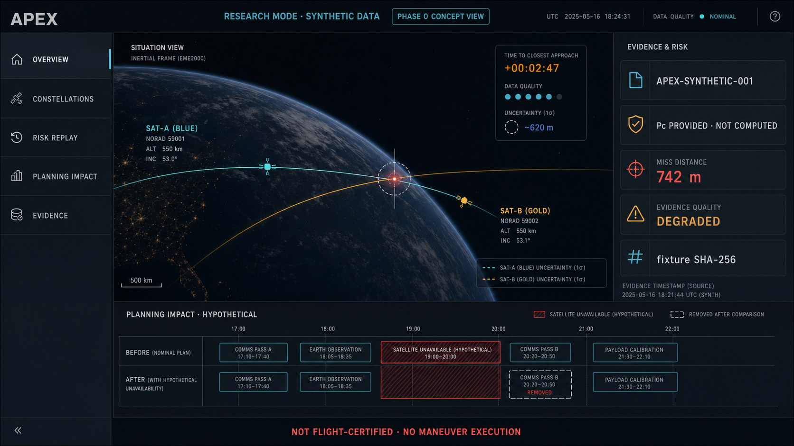

# Apex

[](https://github.com/markliao2025/apex/actions/workflows/ci.yml)
[](https://github.com/markliao2025/apex/actions/workflows/security.yml)
[](LICENSE)

**开源的星座管理、任务规划与合成空间风险分析系统。**

Apex 面向小型卫星团队、研究人员和开源开发者。系统基于 Organization、成员角色和 Constellation 实施数据隔离，提供星座资产管理、任务规划、合成交会事件回放、计划影响分析和证据导出。Phase 0 使用合成输入，适用于本地演示、接口验证和协作开发。

> **Safety boundary:** synthetic demo only — not for operational or flight-safety decisions. Apex Phase 0 does not compute collision probability (Pc), ingest operational CDMs, recommend maneuvers, generate post-maneuver trajectories, or execute commands.



*图像类型：Phase 0 暗黑界面概念图，非当前版本截图。图中风险值为合成输入。该界面不表示飞行认证、真实风险预测或机动执行能力。*

## 处理流程

空间风险事件分析需要同时保留事件数据、来源、质量状态、影响范围和处理结果。Apex Phase 0 定义了以下可复现流程：

1. 根据 Organization、成员角色和 Constellation 确定资产范围与访问权限；
2. 加载版本固定的合成交会事件；
3. 显示 provided Pc、接近距离、相对速度、数据质量和来源限制；
4. 将假设性卫星不可用时间窗输入计划模块，生成 before/after 对比；
5. 导出包含哈希、算法版本、限制条件和安全声明的证据包。

授权 SSA 数据接入、风险趋势分析和受约束 Agent 列入后续阶段。Phase 0 不包含这些功能。

## 核心功能

| 模块 | 输入与处理 | 输出 |
| --- | --- | --- |
| 星座管理 | 管理 Organization、成员角色、Constellation 及目录卫星关联 | 隔离的星座资产范围和可用卫星集合 |
| 任务规划 | 在指定 Constellation 内解析任务意图，使用 CP-SAT 处理简化约束 | 计划请求、任务分配和状态结果 |
| 合成交会回放 | 加载 `APEX-SYNTHETIC-001` 及其 provided Pc、接近距离、相对速度和事件时间 | 确定性的事件回放结果 |
| 数据质量检查 | 检查协方差可用性、字段来源、单位、算法版本和限制条件 | 数据质量状态及降级原因 |
| 计划影响分析 | 输入固定的假设性不可用时间窗，分别执行基线计划和影响计划 | before/after 任务差异 |
| 证据导出 | 汇总 fixture SHA-256、证据哈希、输入来源、算法版本和安全声明 | JSON 或 Markdown 证据包 |
| 开源运行环境 | Docker Compose 启动数据库、迁移、演示数据、API 和前端 | 可重复的本地演示环境 |

Satellite 目录记录仅表示软件目录关联，不表示卫星所有权。Phase 0 不提供真实轨道文件或 CDM 上传。

## 五分钟体验

运行条件：Docker 24+ 和 Docker Compose v2。

```bash
git clone https://github.com/markliao2025/apex.git
cd apex
make demo
```

默认演示无需创建 `.env` 或配置 OpenAI Key，运行路径不访问公网。服务健康检查通过后访问：

- 前端：<http://localhost:5173>
- API 文档：<http://localhost:8000/docs>
- Readiness：<http://localhost:8000/health/ready>

在登录页选择 **Try the synthetic demo**，执行以下步骤：

1. 回放 `APEX-SYNTHETIC-001`；
2. 检查 `Pc provided · not computed` 和缺少协方差的警告；
3. 选择演示 Constellation 中的 Satellite；
4. 比较假设性不可用时间窗前后的计划；
5. 导出 JSON 或 Markdown 证据包。

默认 Compose 数据库和 JWT 配置仅限本机合成演示，不适用于生产环境。

## 能力边界

| 字段或模块 | Phase 0 状态 |
| --- | --- |
| `pc_origin=provided` | Pc 来自仓库内的合成 fixture 输入 |
| `apex_computed_pc=false` | Apex 未独立计算 Pc |
| `covariance_available=false` | 当前 fixture 不包含可用于复算 Pc 的协方差 |
| `physics_verified=false` | 规划影响结果未经过轨道动力学验证，不用于机动或轨道安全判断 |
| `synthetic_conjunction_what_if` | 规划资源不可用假设 |
| 风险预测 | 未实现；当前功能为确定性合成事件回放和计划影响分析 |
| Agent | 未实现；当前系统不包含自主决策、工具调用或命令执行 Agent |
| 飞行系统 | 未集成；系统不下发指令、不生成机动方案，且未通过飞行认证 |

后续 Agent 接口必须调用经过授权、可审计、可回放的类型化工具。轨道事实必须来自确定性领域服务和带来源记录的数据。LLM 输出不得写入轨道事实字段，不得绕过权限或触发机动执行。

## 系统架构

```text
React UI
  ├─ Organization / constellation workspace
  ├─ Scoped task planning
  └─ Synthetic conjunction replay + planning impact + evidence export
          │
FastAPI ──┼─ OrganizationMembership authorization
          ├─ deterministic replay / validation
          ├─ CP-SAT scheduling
          └─ stable ErrorEnvelope + trace_id
          │
PostgreSQL (Alembic migration + idempotent offline bootstrap)
```

默认 Compose 启动顺序：PostgreSQL healthy → migration → offline seed/demo bootstrap → API ready → frontend。Redis 不在默认运行路径中，可使用 `--profile optional` 单独启动。

## 开发与验证

本地 Python 工具默认位于 `backend/.venv`：

```bash
make test           # 后端 + 前端非浏览器测试；默认不访问公网
make lint           # Ruff + ESLint
make typecheck      # Mypy + TypeScript
make verify         # lint + typecheck + tests + build + fixture golden hash
make test-e2e       # 对已启动的 demo 运行 API + Playwright 最小用户旅程
make audit-licenses # 检查直接依赖的开源许可证政策
make release-check  # verify + 开源/发布边界检查
```

确定性 fixture 位于 [`fixtures/demo/conjunction/apex-synthetic-001/`](fixtures/demo/conjunction/apex-synthetic-001/)。哈希或 golden output 发生变化时，应按数据契约变更进行审查。

## API 边界

- `GET /api/v1/organizations`
- `GET|POST /api/v1/constellations`
- `GET|PATCH /api/v1/constellations/{id}`
- `GET|POST /api/v1/constellations/{id}/satellites`
- `DELETE /api/v1/constellations/{id}/satellites/{satellite_id}`
- `POST /api/v1/planning/parse`
- `POST /api/v1/planning/requests`
- `GET /api/v1/demo/status`
- `POST /api/v1/demo/session`
- `POST /api/v1/demo/replays`
- `POST /api/v1/demo/replays/{id}/planning-impact`
- `GET /api/v1/demo/replays/{id}/export?format=json|md`

旧版 Planning API 仅在用户恰好可访问一个 Constellation 时自动选择范围，并返回 `Deprecation: true`。系统不回退到全库 Satellite 查询。

统一错误结构：

```json
{
  "error": {
    "code": "CONSTELLATION_FORBIDDEN",
    "message": "You do not have access to this constellation.",
    "details": {"constellation_id": "..."},
    "retryable": false,
    "trace_id": "uuid"
  }
}
```

## Build in Public

无法开展正式访谈时，项目通过公开构建记录收集需求证据。点赞和浏览量不计入需求验证结果。每周发布：

- 一个可运行增量；
- 一段 60–90 秒的真实操作视频；
- 一个明确的验证问题；
- 失败步骤、阻塞项、错误码和匿名使用数据；
- 下一周的保留、删除或调整决定。

模板、指标定义和证据日志见 [Build in Public 指南](docs/build-in-public/README.md)。完成六个完整日历周后执行 Market-fit Gate。代码完成状态与市场验证状态分别记录。公开路线图见 [ROADMAP.md](ROADMAP.md)。

## 生产支持状态

Phase 0 支持本地 Docker Compose 合成演示和开发测试。当前版本不支持生产级异步任务可靠性、真实 SSA 数据持久化或飞行安全决策。`docker-compose.prod.yml` 是安全配置参考。生产部署前置项包括可靠队列、备份与恢复演练、监控以及 PostgreSQL 迁移测试。

详见 [支持矩阵与限制](docs/operations/SUPPORT_MATRIX.md)。

## 贡献与开源

项目代码采用 [Apache-2.0](LICENSE) 许可证，合成 fixture 采用 CC0-1.0。贡献提交使用 DCO `Signed-off-by`，具体流程见 [CONTRIBUTING.md](CONTRIBUTING.md)。安全问题按照 [SECURITY.md](SECURITY.md) 通过私有渠道报告。

- 数据与模型政策：[docs/legal/DATA_AND_MODEL_POLICY.md](docs/legal/DATA_AND_MODEL_POLICY.md)
- 第三方与生成资产登记：[docs/legal/THIRD_PARTY_ASSETS.md](docs/legal/THIRD_PARTY_ASSETS.md)
- 架构决策：[docs/architecture/](docs/architecture/)
- Phase 0 执行合同：[PHASE0_AI_EXECUTION_PLAN.md](PHASE0_AI_EXECUTION_PLAN.md)

## License

Code: Apache-2.0. Synthetic demo fixture: CC0-1.0.
